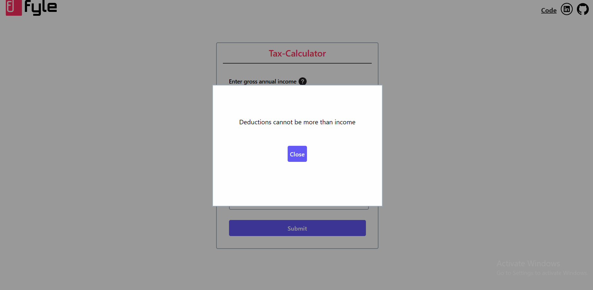

## How to run locally

Step 1:
```
https://github.com/ankit-suman-07/tax-calculator.git
```
Step 2:
```
Open Fyle folder
```

Step 2:
```
Double click on the file index.html
```

## Deployed at: [Link](https://tax-calulator.netlify.app/)

## Features
- Calculates tax based on the input for gross income, extra income and deductions.
- Income after deducting this tax from the total income is displayed.
- Invalid inputs can be entered, but an error is presented to inform regarding invalid inputs.
- Amount is entered in INR and not in Lakhs (800000 is entered instead of 8 Lakhs)
- Result cannot be displayed if there is any input left empty.
- All the fields are mandatory.
- Icons appear to display the possible error.
- If deductions are more than total income, then an error pop-up is displayed.
- Input values are reset only when input after tax is displayed are valid entries.

## Tasks Accomplised
- Created a Tax-Calculator using HTML, CSS and JavaScript.
- Design kept as close as possible to the given design.
- Tax calculation formula used as given in the task.
- All edge cases has been handled

## Output Screenshots

### Valid Outputs


### Invalid Deductions entered


### Opening Screen


### Input field info


### Error, when submitting without valid input


### Error, entering characters instead of digits


## Resume [PDF Link](https://flowcv.com/resume/asuhgn35q8)
